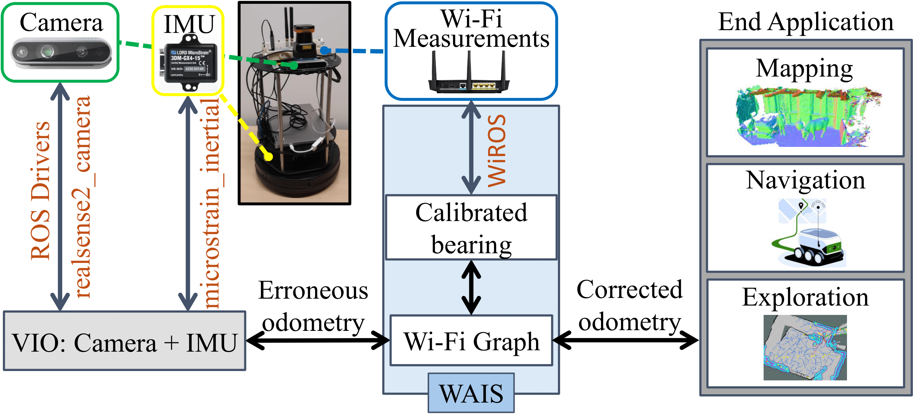

# WiFi Assisited Indoor SLAM

Visual (LiDAR/camera-based) SLAM systems deploy **compute** and **memory-intensive** search algorithms to detect "Loop Closures" to make the trajectory estimate globally consistent.
Instead, WAIS (<u>W</u>iFi <u>A</u>ssisted <u>I</u>ndoor <u>S</u>LAM) demonstrates using WiFi-based sensing can reduce this resource intensiveness drastically. 

By covering over 1500 m in realistic indoor environments and WiFi deployments, we showcase 4.3 x and 4 x reduction in compute and memory consumption compared to state-of-the-art Visual and Lidar SLAM systems. Incorporating WiFi into the sensor stack also improves the resiliency of the Visual-SLAM system. We find the 90th percentile translation errors improve by ~40% and orientation errors by ~60% compared with purely camera-based systems. 

<p align="center"></p>

The following video showcases WAIS's performance on the dataset provided below. You may use the code here to recreate this demo as a starting point. 

<p align="center"><a href="https://www.youtube.com/watch?v=FIAdBC_UzPU"></a></p>

## Contents
1. [Usage](#usage)
2. [Dataset Information and Download](#dataset-information-and-download)
3. [WiROS data collection module](#wiros-platform)
4. [Citation](#citation)

## Usage

This project directory contains four primary folders:
1. [python](./python): Helper code to extract path data collected in bag files 
2. [rviz](./rviz): RVIZ config file to visualize the path, AP positions, memory and compute trends. 
3. [launch](./launch): Use [wais.launch](./launch/wais.launch) contained inside to run the provided dataset
4. [src](./src): Contains the packages to run WAIS and monitor the memory and CPU information. 
    1. [cpu_monitor](./src/cpu_monitor): Publish CPU and RAM memory usage to individual topics. More information [here](https://github.com/alspitz/cpu_monitor). 
    2. [graph_rviz_plugin](./src/graph_rviz_plugin): QT plugin to plot lines graphs in RVIZ. More information [here](http://wiki.ros.org/graph_rviz_plugin). 
    3. [python-node](./src/python-nodes): Helper codes to process [P2SLAM datasets](https://wcsng.ucsd.edu/p2slam/), compute relative odometry, and plot path within python. 
    4. [rf_msgs](./src/rf_msgs): A clone of [rf_msgs](https://github.com/ucsdwcsng/rf_msgs) message type from WiROS package.
    5. [wifi_backend](./src/wifi_backend): Main package which contains the code to run WAIS's WiFi factor graph.
   
To install these packages, clone this repository and in the repository's root folder run `catkin build`: 

```
cd /home/user/
git clone https://github.com/ucsdwcsng/WAIS.git
cd WAIS
catkin build
```

Source the packages and confirm the paths are included:
```
source ./devel/setup.bash
echo $ROS_PACKAGE_PATH
```

Download the dataset following the guidelines provided [below](#dataset-information-and-download) and change the bag path param name in the [launch file](./launch/wais.launch).
```
<!-- Download the dataset and add the path of the bag file here -->
<arg name="bag_path"    default = "path/to/dataset bag file" />
```

Run the launch file. This should open a termux window to play the bag file and an rviz window to display the data. Note the bag file will take a few minutes to open for the first time: 
```
roslaunch ./launch/wais.launch
```

## Dataset Information and Download

We provided the WAIS dataset to test this code. The dataset can be downloaded by agreeing to the terms and conditions and filling up [this form](https://forms.gle/XWLLBnWsMct1BRnR8). You will receive instructions to download the dataset via the provided email.

The dataset is a rosbag with the following data: 

```
path:        7-22.bag
version:     2.0
duration:    23:43s (1423s)
start:       Jul 21 2022 18:17:57.96 (1658452677.96)
end:         Jul 21 2022 18:41:41.07 (1658454101.07)
size:        6.0 GB
messages:    1311099
compression: none [8011/8011 chunks]
types:       kobuki_msgs/SensorState     [430a4bfd78449c8740bfef32b2661]
             nav_msgs/Odometry           [cd5e73d190d741a2f92e81eda573a]
             realsense2_camera/IMUInfo   [a02adb3a99530b11ba18a16f40f95]
             rf_msgs/Aoa                 [967f0be24bd6e9e8f5c88973721bd]
             rf_msgs/Wifi                [c6b3816e58324f4c826cc5e2cd4f2f]
             sensor_msgs/CameraInfo      [c9a58c1b0b154e0e6da7578cb991d2]
             sensor_msgs/CompressedImage [8f7a12909da2c9d3332d540a097756]
             sensor_msgs/Imu             [6a62c6daae103f4ff57a132d6f95ce]
             sensor_msgs/LaserScan       [90c7ef2dc6895d81024acba2ac42f36]
             std_msgs/Float32            [73fcbf46b49191e672908e50842a83d]
             std_msgs/UInt64             [1b2a79973e8bf53d7b53acb71299cb5]
             tf2_msgs/TFMessage          [94810edda583a504dfda3829e70d7ee]
topics:      /aoa                                        14634 msgs    : rf_msgs/Aoa               
             /camera/accel/imu_info                          1 msg     : realsense2_camera/IMUInfo 
             /camera/color/camera_info                   42669 msgs    : sensor_msgs/CameraInfo    
             /camera/color/image_raw/compressed          42669 msgs    : sensor_msgs/CompressedImag
             /camera/depth/camera_info                   42678 msgs    : sensor_msgs/CameraInfo    
             /camera/depth/image_rect_raw/compressed     42677 msgs    : sensor_msgs/CompressedImag
             /camera/gyro/imu_info                           1 msg     : realsense2_camera/IMUInfo 
             /camera/imu                                270369 msgs    : sensor_msgs/Imu           
             /camera/infra1/camera_info                  42678 msgs    : sensor_msgs/CameraInfo    
             /camera/infra1/image_rect_raw/compressed    42678 msgs    : sensor_msgs/CompressedImag
             /camera/infra2/camera_info                  42678 msgs    : sensor_msgs/CameraInfo    
             /camera/infra2/image_rect_raw/compressed    42678 msgs    : sensor_msgs/CompressedImag
             /cpu_monitor/aoa_node/cpu                    1176 msgs    : std_msgs/Float32          
             /cpu_monitor/aoa_node/mem                    1176 msgs    : std_msgs/UInt64           
             /csi                                        18061 msgs    : rf_msgs/Wifi               
             /mobile_base/sensors/core                   71121 msgs    : kobuki_msgs/SensorState    
             /mobile_base/sensors/imu_data               71121 msgs    : sensor_msgs/Imu            
             /mobile_base/sensors/imu_data_raw          154834 msgs    : sensor_msgs/Imu            
             /odom                                       71119 msgs    : nav_msgs/Odometry          
             /scan                                       56490 msgs    : sensor_msgs/LaserScan      
             /tf                                        239589 msgs    : tf2_msgs/TFMessage         
             /tf_static  
```
## WiROS Platform

This work also open-sources the WiROS platform, which allows researchers to conveniently collect WiFi CSI information and process this information to extract AoA and ToF of the received signal. More details can be found [here](https://github.com/ucsdwcsng/WiROS).

## Citation

If you have found this work useful, please cite us as following: 

```
@article{arun2022viwid,
title={ViWiD: Leveraging WiFi for Robust and Resource-Efficient SLAM},
author={Arun, Aditya and Hunter, William and Ayyalasomayajula, Roshan and Bharadia, Dinesh},
journal={arXiv preprint arXiv:2209.08091},
year={2022}
}
```
